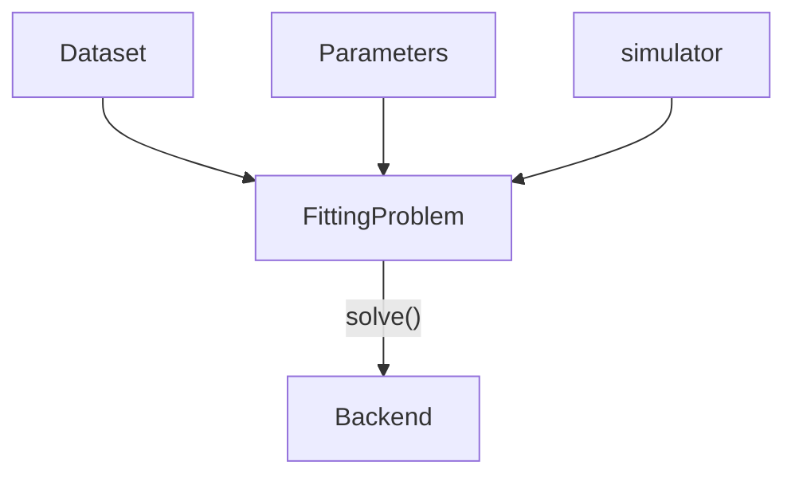

# mempyfit

This package is part of the `mempy` ecosystem. <br>
The goal of this package is to provide basic functioanlity to fit (DEB-)TKTD models using either local optimization, global optimization or likelihood-free Bayesian inference.

You can install the package using the repo URL and pip:

```bash
pip install git+https://github.com/simonhansul/mempyfit
```

For a quickstart, see notebooks under `examples`.

The figure below gives an overview of how the different classes are used 
to solve a fitting problem. 



The basic  principle is that we always provide the same basic ingredients to define a `FittingProblem`.
We can solve a `FittingProblem` through the `solve()` mehtod, in which we specify the `Backend` to use (e.g. `ScipyBackend`). The backend determines which algorithms can be used to do the actual fitting behind the scenes.